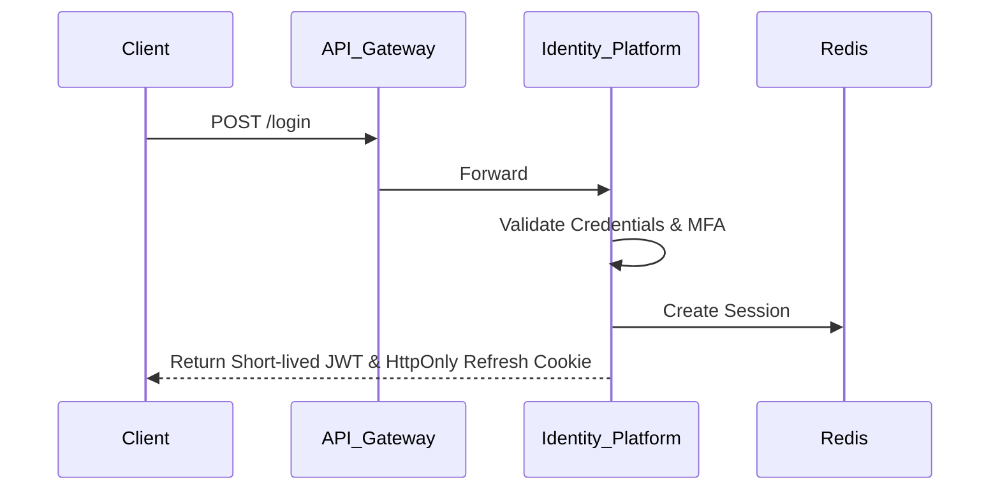

# Volume 4 – Domain Architecture: Identity Platform
**Document Status:** DRAFT (Pending Approval via AR-0003)
**Version:** 1.0

---

## Part 1: Strategic Overview

### 1. Executive Summary
The Identity Platform is the foundational Zero Trust pillar of the CYBERMIND CyberOS. It serves as the single, immutable source of truth for all authentication, authorization, session management, and trust evaluation across every domain module (SOC, CTI, SIEM, etc.).

### 2. Design Goals
- Provide seamless, secure, and scalable access control.
- Support deep multi-tenancy and complex organizational hierarchies.
- Enable both human (Passwordless, SSO, Passkeys) and machine (API Keys, PATs, Service Accounts) authentication.
- Centralize all policy evaluation and RBAC/ABAC enforcement.

### 3. Guiding Principles
- **Zero Trust:** Never trust, always verify. Every internal and external request must be authenticated and authorized.
- **Least Privilege:** Default deny. Access is granted explicitly.
- **Decoupled Security:** Domain modules must not implement their own auth logic; they must delegate to Identity.

---

## Part 2: Domain-Driven Design (DDD)

### 4. Bounded Contexts & 5. Context Map
The Identity Platform is an upstream core domain.
- **Downstream Consumers:** AI Platform, CTI, SOC, SIEM, Workflow, API Gateway.
- **Upstream Dependencies:** None (Root Domain).

### 6. Ubiquitous Language
- **Tenant:** A top-level billing and data-isolation boundary.
- **Organization:** A logical grouping within a Tenant.
- **Principal:** Any entity (User, Machine, Device) requesting access.
- **Policy:** A rule defining what a Principal can do.
- **Claim:** A verifiable statement about a Principal.

### 7. Domain Model, 8. Aggregates, 9. Entities, 10. Value Objects
- **Aggregates:** `Tenant`, `User`, `Role`, `Policy`.
- **Entities:** `Organization`, `Team`, `Group`, `Session`, `APIKey`, `ServiceAccount`.
- **Value Objects:** `EmailAddress`, `MfaToken`, `PermissionClaim`, `IPRange`.

### 11. Domain Events
- `UserAuthenticated`, `UserLockedOut`, `MfaEnrolled`, `RoleAssigned`, `TenantCreated`, `SessionRevoked`, `ApiKeyRotated`.

---

## Part 3: Architecture & Services

### 12. Application Services & 13. Infrastructure Services
- **App Services:** `AuthenticationService`, `SessionService`, `TenantProvisioningService`, `PolicyEvaluationService`.
- **Infra Services:** `JwtIssuer`, `LdapConnector`, `OAuth2Client`, `RedisSessionStore`.

### 14. Public APIs
- `POST /api/identity/auth/login`
- `POST /api/identity/auth/sso/saml`
- `GET /api/identity/sessions`
- `POST /api/identity/roles/evaluate`

### 15. Authentication Architecture
Supports: Local, Passwordless, OAuth2, OIDC, SAML, LDAP, Azure AD, Google Workspace, FIDO2/Passkeys, API Keys, PATs, Service Accounts, Machine/Device Identities.

### 16. Authorization Architecture & 17. Trust Model
- Enforces RBAC (Role-Based) and ABAC (Attribute-Based), ready for future PBAC (Policy-Based).
- Trust Model assumes network hostility; identity context must be cryptographically signed (JWT) and passed with every request.

### 18. Session Architecture & 19. Token Lifecycle
- Uses short-lived access tokens (JWT, 15 min TTL) and stateful refresh tokens backed by Redis (sliding expiration, max 7 days).
- Implements PKCE for OAuth flows. Strict token revocation via Redis blocklists.

### 20. Permission Engine & 21. Policy Engine
- **Permission Engine:** Resolves static roles to permissions (e.g., `Viewer` -> `read:alert`).
- **Policy Engine:** Evaluates dynamic constraints (e.g., `read:alert` ONLY IF `IP in Corporate Range` AND `Time between 9-5`).

---

## Part 4: Multi-Tenancy & Federation

### 22. Multi-Tenant Strategy & 23. Organisation Hierarchy
Deep hierarchy: `Tenant -> Organization -> Team -> Group -> User`. All database tables contain `tenant_id` for strict Row-Level Security (RLS) isolation.

### 24. Identity Federation & 25. External Identity Providers
Supports SCIM for automated user lifecycle provisioning/de-provisioning. Supports Just-In-Time (JIT) provisioning for federated logins (Azure AD, Okta).

---

## Part 5: Security & Observability

### 26. Audit Architecture
100% coverage of auth events. Immutable logging to standard output and Event Bus (`IdentityAuditTrail`).

### 27. Security Architecture & 28. Threat Model
- Mitigates OWASP Top 10. Protection against credential stuffing, brute force, and token hijacking via IP binding and anomaly detection (Login Analytics).

### 29. Data Model & 30. Database Schema (Conceptual)
`users (id, tenant_id, email, password_hash, mfa_secret)`
`sessions (id, user_id, refresh_token_hash, expires_at, device_fingerprint)`
`roles (id, tenant_id, name, permissions_json)`
`api_keys (id, tenant_id, key_hash, scopes, expires_at)`

### 31. Sequence Diagrams

---

## Part 6: Operations & Deployment

### 32. Deployment Architecture & 33. Scalability Strategy
Stateless API instances behind a load balancer. Stateful sessions in Redis Cluster. Database reads scale via PostgreSQL read-replicas.

### 34. Failure Recovery & 35. Disaster Recovery
- Multi-AZ deployment.
- Read-replica promotion for DB failure.
- If Redis fails, all users re-authenticate (stateless JWTs continue working until expiry).

### 36. Monitoring & 37. Observability
Prometheus metrics: `auth_success_rate`, `auth_latency`, `token_issuance_rate`, `mfa_failures`.

### 38. Security Controls
Strict Rate Limiting, Conditional Access rules, and Login Risk scoring.

---

## Part 7: Forward Planning

### 39. Future Expansion
- Zero Trust Network Access (ZTNA) integration.
- Continuous Authentication (Behavioral Biometrics).
- PBAC (Policy-Based Access Control) using OPA (Open Policy Agent).

### 40. Risks
- Identity Platform is a single point of failure (SPOF) for the entire CYBERMIND ecosystem. High Availability (HA) is paramount.

### 41. Engineering Decisions & 42. ADRs
- **EDR-ID-01:** Use Redis for Refresh Tokens (allows instant revocation).
- **EDR-ID-02:** Short-lived JWTs (15 min) to minimize exposure windows without querying DB per request.

### 43. Open Questions
- Will we require support for physical smart cards (PIV/CAC) for government deployments?
- Should Identity provide a built-in CAPTCHA service for failed login brute-force defense?

---

## Part 8: Architecture Validation Checklist

- [x] Clean Architecture
- [x] SOLID Principles
- [x] DDD Boundaries
- [x] Zero Trust Enforced
- [x] Enterprise Scalability
- [x] Cloud Native Deployment
- [x] High Availability Built-In
- [x] Security by Design
- [x] Maintainability
- [x] Extensibility
- [x] Platform Consistency
